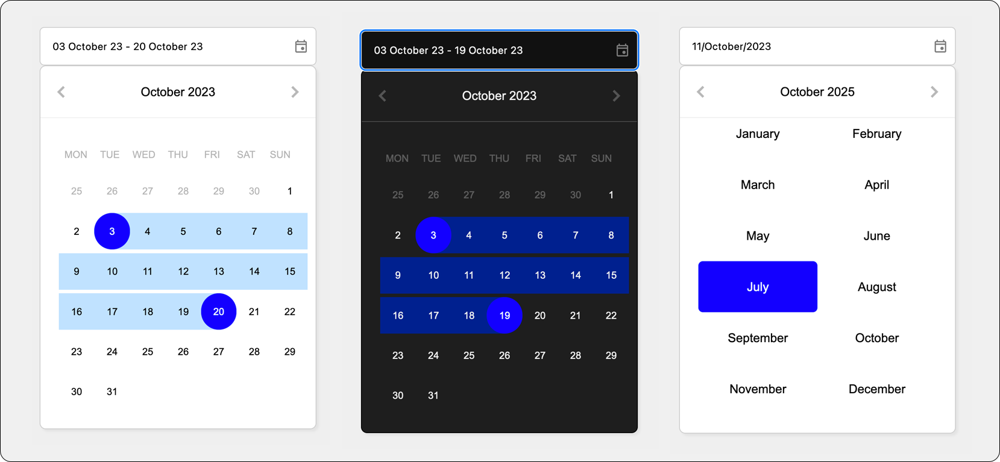

# NGX Date Picker

A simple-to-use date picker component for use in Angular (ngx) projects. This component provides your users the ability
to select a date or a date range using a clean, sharp looking popup user interface.



## Features

- Not external libraries
- Wide Angular version support
- Modular (separate input component and picker components)
- Ability to select single date or date range
- Easy to style

## Demo

To view the demo, please clone the repo and run the following commands:

```shell
npm install && ng serve
```

## Using the Input Component (easiest)

### How To Use

If you wish to show an input component that will allow your uses to select a date or date range, use the following
code:

**In your template:**

```html
<ngx-date-picker-input [(date)]="dateSelection" (dateChange)="onDateChanges()"></ngx-date-picker-input>
<div>{{dateSelection | json}}</div>
```

**In your component:**

```typescript
@Component({
  templateUrl: './example.component.html',
  styleUrls: ['./example.component.scss']
})
export class ExampleComponent {
    dateSelection: DateSelection | undefined

  onDateChanges() {
    console.log(this.dateSelection);
  }
}
```

The `dateSelection` property uses a two-way binding, so you can either bind it directly to your template
or perform an action within the `onDateChanges()` method above.

### Configuration

You can configure both the date input and also the date picker using the `NgxDatePickerInputConfig` interface. For example,
you can use the following code to enable `dark-mode`:

```typescript
datePickerConfig: NgxDatePickerInputConfig = Object.assign(getInputConfigDefaults(), {
  darkMode: false
});
```

You then just need to pass that config to the `ngx-date-picker-input` using the `[config]="datePickerConfig"` attribute.

**Full options are listed below:**

```typescript
{
  minDate: Date;
  maxDate: Date;
  initialView: ViewMode;
  rangeMode: boolean;
  darkMode: boolean;
  datePresentationFormat: string;
  datePresentationLocale: string;
  datePresentationValue: any;
}
```

## Using the Picker Directory

If you do not wish to use the input component, you can instead use the picker directly.

### How To Use

```html
<ngx-date-picker [(date)]="dateSelection" (dateChange)="onDateChanges()"></ngx-date-picker>
<div>{{dateSelection | json}}</div>
```

**In your component:**

```typescript
@Component({
  templateUrl: './example.component.html',
  styleUrls: ['./example.component.scss']
})
export class ExampleComponent {
    dateSelection: DateSelection | undefined

  onDateChanges() {
    console.log(this.dateSelection);
  }
}
```

## Styling

If you would like to override styling, you can use the following (as an example):

**Change the date selector day color:**

```css
::ng-deep ngx-date-picker {
  --ngx-date-picker-highlight-background-color: red !important;
}
```

**Change the date picker input width and background color:**

```css
::ng-deep ngx-date-picker-input {
  width: 450px;
}

::ng-deep ngx-date-picker-input input {
  background-color: #efefef;
}
```

## Contributing

Feel free to fire off a PR if you have any improvements.

## Support

Please contact me if you need any help.
